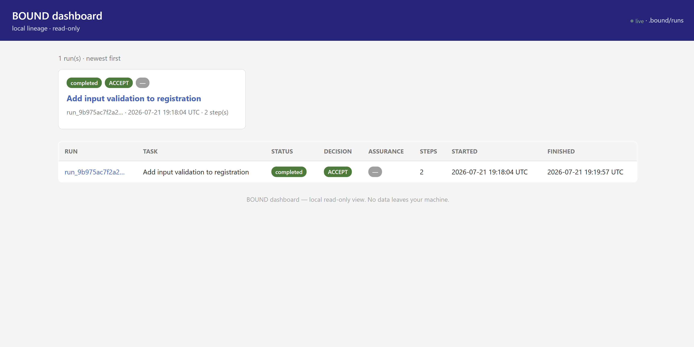
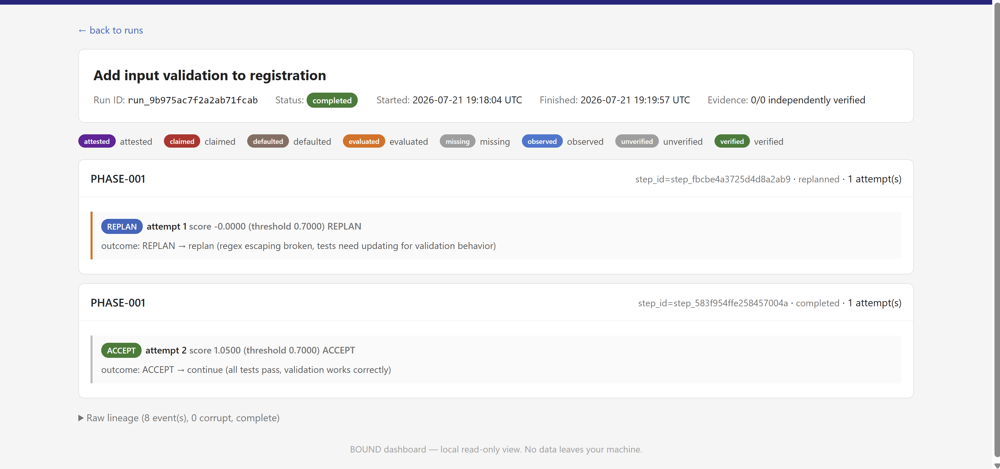

<p align="center">
  <a href="https://github.com/Danny-de-bree/bound/actions/workflows/ci.yml"></a>
  <a href="https://pypi.org/project/bound-policy/"></a>
  <a href="https://pypi.org/project/bound-policy/"></a>
  <a href="https://github.com/Danny-de-bree/bound/blob/main/LICENSE"></a>
  <a href="https://skills.sh/Danny-de-bree/bound"></a>
</p>

# BOUND

BOUND is a deterministic decision harness for coding agents. The agent does the
work; BOUND decides whether to continue, retry, replan, or rollback. No LLM as
judge, no telemetry, no network. Language-neutral — works with any project,
any agent, any language. **The model proposes. The harness decides.**

<p align="center">
  
</p>

## The four decisions

| Decision | Meaning | Agent action |
| --- | --- | --- |
| **ACCEPT** | Evidence satisfies the approved policy. | Stop optimizing, continue. |
| **RETRY** | The current approach is still viable. | Make one focused correction and collect fresh evidence. |
| **REPLAN** | The current strategy is no longer the right path. | Choose a materially different approach and derive a new step contract. |
| **ROLLBACK** | A hard risk boundary was exceeded. | Restore a previously confirmed safe checkpoint, then replan. |

BOUND emits the signal; the agent performs the action.

## Get started in 3 sentences

Install the CLI with `pip install bound-policy` and add one of the integration prompts to your agent so it knows how and when to call BOUND. Onboard your project with `bound init` — it auto-detects your test, lint, and type-check tooling and generates a reviewable `bound-policy.yaml` without running any tool or touching the network. Then let the agent do the work, calling `bound evaluate` at each meaningful step and acting on the ACCEPT / RETRY / REPLAN / ROLLBACK verdict BOUND returns — open `bound ui` if you want to watch live.

## Install — two parts, one time

You need **both**: the BOUND CLI on your machine, and the integration prompt
in your agent. The agent calls the CLI; the CLI does the work.

### 1. Install the BOUND CLI on your machine

```bash
pip install bound-policy
```

### 2. Add the integration prompt to your agent

The prompt tells your agent how and when to call BOUND. Pick one:

| Agent | How to install the prompt |
| --- | --- |
| **Cline** | Paste [`integrations/cline/INSTALL_BOUND.md`](integrations/cline/INSTALL_BOUND.md) into a Cline session |
| **Codex** | Paste [`integrations/codex/INSTALL_BOUND.md`](integrations/codex/INSTALL_BOUND.md) into a Codex session |
| **Claude Code** | Paste [`integrations/claude-code/INSTALL_BOUND.md`](integrations/claude-code/INSTALL_BOUND.md) into Claude Code |
| **Kilo Code** | Paste [`integrations/kilo-code/INSTALL_BOUND.md`](integrations/kilo-code/INSTALL_BOUND.md) into Kilo Code |
| **Any agent** | Paste [`integrations/generic/INSTALL_BOUND.md`](integrations/generic/INSTALL_BOUND.md) |
| **skills.sh** | `npx skills add Danny-de-bree/bound --skill bound` |

That's it. The agent now calls `bound evaluate` on your machine whenever it
finishes a meaningful step. You run `bound ui` whenever you want to watch.

## How it works in an agent

Your agent executes a step → gathers evidence (test results, lint, type-check) →
feeds the signals to BOUND → BOUND applies your policy → BOUND emits
ACCEPT / RETRY / REPLAN / ROLLBACK → the agent acts on it.

A real session looks like this:

```text
1. Agent creates a bound-policy.yaml
   → Python project: bound init (auto-detects pytest, ruff, mypy)
   → JavaScript/Go/Rust/anything: write one based on the default policy
     (it's just YAML — test command, lint command, threshold)

2. Agent validates the policy
   → bound policy validate bound-policy.yaml

3. Agent starts a run
   → bound run start "Add input validation to registration"

4. Agent implements, runs tests → 0/2 pass (regex broken)
   → bound evaluate-workflow --test-pass-rate 0.0 --lint-passed ...
   → Decision: REPLAN  (S=-0.55, tests failing badly)
   → bound outcome --decision REPLAN --note "regex escaping broken"

5. Agent fixes code, runs tests → 3/3 pass
   → bound evaluate-workflow --test-pass-rate 1.0 --lint-passed --type-check-passed ...
   → Decision: ACCEPT  (S=1.05 ≥ T=0.70)
   → bound outcome --decision ACCEPT --note "all tests pass"

6. Agent finishes the run
   → bound run finish --status completed
```

The scores come from whatever your project uses — `pytest`, `jest`, `go test`,
`cargo test`, `ruff`, `eslint`, `mypy`, `tsc` — BOUND doesn't care. You feed
it the results; it applies the policy and emits the decision.

### Watch it live

While the agent works, open the dashboard in a separate terminal:

```bash
bound ui --open
```

The dashboard at http://127.0.0.1:8765 shows every run as a decision tree —
plan → step → attempt → decision — with evidence provenance. It auto-refreshes
when new decisions arrive.

**Overview — all your runs at a glance:**

<p align="center">
  
</p>

**Run detail — decision tree with evidence provenance:**

<p align="center">
  
</p>

```text
Step 1 · First try: regex broken · replanned
└── Attempt 1 · REPLAN · S=0.00 (A=0.00 I=0.30 R=0.10 C=0.20)

Step 2 · Fixed, all tests pass · completed
└── Attempt 2 · ACCEPT · S=1.05 (A=1.00 I=0.30 R=0.05 C=0.20)
```

### Adjust the policy mid-run

Edit `bound-policy.yaml` anytime — the agent's next `bound evaluate` picks up
the new policy automatically. Each decision records which policy version was
used, so old decisions stay reproducible.

```bash
bound policy explain bound-policy.yaml   # see what your policy does
```

### Three integration modes

| Mode | How | Command |
| --- | --- | --- |
| Manual | Agent calls BOUND at each boundary | `bound evaluate ...` |
| Event-driven | Stream JSONL events, BOUND evaluates automatically | `bound watch --policy ...` |
| MCP | Agent uses BOUND as MCP tools | `bound mcp` |

## License

MIT © Danny de Bree. See [LICENSE](LICENSE).

## Guides

- **[Python & CLI reference](docs/python-usage.md)** — install, full command options, `bound init`, collectors, Python API
- **[Architecture & scoring model](architecture/README.md)** — how the bounded-utility formula works
- **[Decision lineage](docs/lineage.md)** — run history, evidence provenance, inspection
- **[Default policy](src/bound/default_policy.yaml)** — a fully documented starting point
- **[Agent integration guides](integrations/)** — Cline, Codex, Claude Code, Kilo Code, Hermes, and generic
- **[BOUND skill](skills/bound/SKILL.md)** — the agent-ready skill prompt
- **[Demo scenario](docs/demo-scenario.md)** — canonical end-to-end walkthrough
