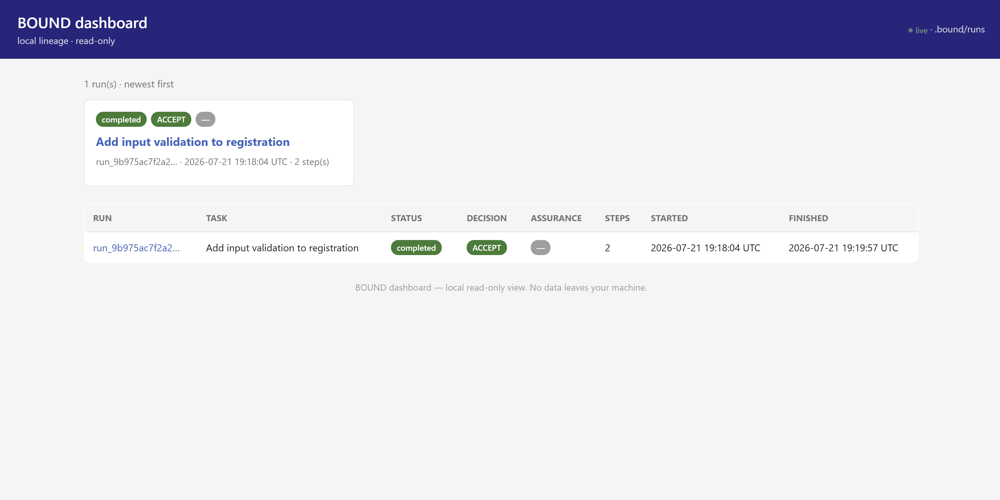
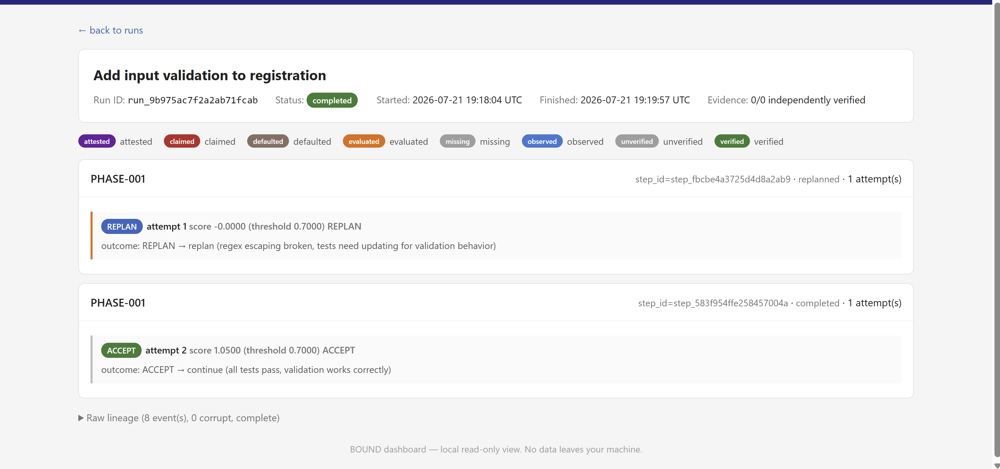

<p align="center">
  <a href="https://github.com/Danny-de-bree/bound/actions/workflows/ci.yml"></a>
  <a href="https://pypi.org/project/bound-policy/"></a>
  <a href="https://pypi.org/project/bound-policy/"></a>
  <a href="https://github.com/Danny-de-bree/bound/blob/main/LICENSE"></a>
  <a href="https://skills.sh/Danny-de-bree/bound"></a>
</p>

# BOUND

BOUND is a deterministic decision harness for coding agents. The agent does the
work; BOUND decides whether to continue, retry, replan, or rollback. No LLM as
judge, no telemetry, no network. Language-neutral — works with any project,
any agent, any language. **The model proposes. The harness decides.**

<p align="center">
  
</p>

## The four decisions

| Decision | Meaning | Agent action |
| --- | --- | --- |
| **ACCEPT** | Evidence satisfies the approved policy. | Stop optimizing, continue. |
| **RETRY** | The current approach is still viable. | Make one focused correction and collect fresh evidence. |
| **REPLAN** | The current strategy is no longer the right path. | Choose a materially different approach and derive a new step contract. |
| **ROLLBACK** | A hard risk boundary was exceeded. | Restore a previously confirmed safe checkpoint, then replan. |

BOUND emits the signal; the agent performs the action.

## Get started in 3 sentences

Install with `pip install bound-policy`, then run `bound setup --agent generic` to auto-detect your tooling, generate a policy, and create an integration prompt in `.bound/integration-prompt.md`. **Paste that prompt into your agent** — it tells the agent when and how to call `bound evaluate` at each step. From there the agent does the work, BOUND decides ACCEPT / RETRY / REPLAN / ROLLBACK, and you can watch live with `bound ui`.

## Install — two parts, one command

You need the BOUND CLI on your machine **and** the integration prompt in your
agent. `bound setup` handles both.

### 1. Install the BOUND CLI

```bash
pip install bound-policy
```

### 2. Onboard your project

```bash
bound setup --agent generic
```

This auto-detects your test, lint, and type-check tooling, generates
`bound-policy.yaml`, installs the integration prompt for your agent, and
validates the policy — all without running any tool or touching the network.

For other agents, pass `--agent`:

| Agent | Command |
| --- | --- |
| Any agent | `bound setup --agent generic` |
| Cline | `bound setup --agent cline` |
| Codex | `bound setup --agent codex` |
| Claude Code | `bound setup --agent claude-code` |

Or paste a prompt manually from [`integrations/`](integrations/).

### 3. Paste the prompt into your agent

```bash
cat .bound/integration-prompt.md
```

Copy the output and paste it into your coding agent. The agent now knows
when and how to call `bound evaluate`. That's it.

## How it works in an agent

Your agent executes a step → gathers evidence (test results, lint, type-check) →
feeds the signals to BOUND → BOUND applies your policy → BOUND emits
ACCEPT / RETRY / REPLAN / ROLLBACK → the agent acts on it.

A real session looks like this:

```text
1. Onboard the project
   → bound setup --agent generic (auto-detects pytest, ruff, mypy,
     generates bound-policy.yaml, installs integration prompt, validates)

2. Agent starts a run
   → bound run start "Add input validation to registration"

3. Agent implements, runs tests → 0/2 pass (regex broken)
   → bound evaluate-workflow --test-pass-rate 0.0 --lint-passed ...
   → Decision: REPLAN  (S=-0.55, tests failing badly)
   → bound outcome --decision REPLAN --note "regex escaping broken"

4. Agent fixes code, runs tests → 3/3 pass
   → bound evaluate-workflow --test-pass-rate 1.0 --lint-passed --type-check-passed ...
   → Decision: ACCEPT  (S=1.05 ≥ T=0.70)
   → bound outcome --decision ACCEPT --note "all tests pass"

5. Agent finishes the run
   → bound run finish --status completed
```

The scores come from whatever your project uses — `pytest`, `jest`, `go test`,
`cargo test`, `ruff`, `eslint`, `mypy`, `tsc` — BOUND doesn't care. You feed
it the results; it applies the policy and emits the decision.

### Watch it live

While the agent works, open the dashboard in a separate terminal:

```bash
bound ui --open
```

The dashboard at http://127.0.0.1:8765 shows every run as a decision tree —
plan → step → attempt → decision — with evidence provenance. It auto-refreshes
when new decisions arrive.

**Overview — all your runs at a glance:**

<p align="center">
  
</p>

**Run detail — decision tree with evidence provenance:**

<p align="center">
  
</p>

```text
Step 1 · First try: regex broken · replanned
└── Attempt 1 · REPLAN · S=0.00 (A=0.00 I=0.30 R=0.10 C=0.20)

Step 2 · Fixed, all tests pass · completed
└── Attempt 2 · ACCEPT · S=1.05 (A=1.00 I=0.30 R=0.05 C=0.20)
```

### Adjust the policy mid-run

Edit `bound-policy.yaml` anytime — the agent's next `bound evaluate` picks up
the new policy automatically. Each decision records which policy version was
used, so old decisions stay reproducible.

```bash
bound policy explain bound-policy.yaml   # see what your policy does
```

### Three integration modes

| Mode | How | Command |
| --- | --- | --- |
| **Prompt** | Agent reads instructions, calls BOUND at each boundary | `bound evaluate ...` |
| **MCP / Watch** | Agent calls BOUND tools or streams JSONL events | `bound mcp` / `bound watch` |
| **Adapter (v0.9.5)** | BOUND spawns agent as child, full control loop via ACP | Python API |

### Native adapter control (v0.9.5) — strongest integration

The adapter layer lets BOUND **actively control** the agent instead of waiting
for it to call `bound evaluate`. BOUND spawns the agent as a child process,
reads events from its stdout, evaluates each step, and sends decisions back
via stdin — all through the ACP (Adapter Control Protocol), a JSONL message
format.

```python
from bound.adapters import GenericProcessAdapter
from bound.runtime import BoundRuntime

# Any CLI agent that speaks ACP JSONL on stdin/stdout
adapter = GenericProcessAdapter(
    agent_command=["python", "-m", "my_agent", "--acp"],
    working_dir="/path/to/project",
)

# BOUND drives the full control loop
runtime = BoundRuntime.from_policy("bound-policy.yaml")
result = runtime.run_with_adapter(
    adapter=adapter,
    task="Implement input validation",
    plan=load_plan("plan.md"),
)
# → BOUND spawns agent → agent does work → agent reports events
# → BOUND evaluates → BOUND sends ACCEPT/RETRY/REPLAN/ROLLBACK
# → Agent handles decision → repeat until done
```

**How the agent speaks ACP** (minimal example):

```python
import sys, json

# Agent reads the task from BOUND on stdin
task = json.loads(sys.stdin.readline())

# Agent does work, then reports completion
print(json.dumps({
    "type": "step.completed",
    "evidence": {"tests_pass": 3, "tests_total": 3, "lint_ok": True},
    "candidate_id": task["candidate_id"],
}), flush=True)

# Agent waits for BOUND's decision on stdin
decision = json.loads(sys.stdin.readline())
if decision["type"] == "continue":
    # ... next step
elif decision["type"] == "replan":
    # ... rethink approach
```

The adapter is **language-agnostic** — your agent can be Python, Node.js, Rust,
Go, or a shell script. As long as it reads JSONL commands from stdin and writes
JSONL events to stdout, BOUND can control it.

Reference integrations for Cline, Codex, and Claude Code live in
[`integrations/`](integrations/).  See also the tests at
`tests/test_adapters_generic.py` for working examples.

### Built-in native adapters

```bash
# One-command setup for any supported agent:
bound adapter install cline     # generates .cline/mcp/bound.json MCP config
bound adapter install claude    # validates claude-code CLI availability
bound adapter install codex     # validates codex CLI availability
```

| Adapter | Agent | Mechanism | Module |
|---|---|---|---|
| **ClaudeCodeAdapter** | Claude Code | subprocess: `--print --output-format stream-json` | `adapters/claude_code.py` |
| **CodexAdapter** | Codex | subprocess: `exec` + MCP | `adapters/codex.py` |
| **ClineMCPAdapter** | Cline | MCP server config | `adapters/cline.py` |
| **GenericProcessAdapter** | Any CLI | subprocess with ACP JSONL | `adapters/generic.py` |

```python
from bound.adapters.claude_code import ClaudeCodeAdapter
from bound.runtime import BoundRuntime

adapter = ClaudeCodeAdapter(model="claude-sonnet-4-20250514")
runtime = BoundRuntime.from_policy("bound-policy.yaml")
result = runtime.run_with_adapter(adapter, task="Fix validation bug")
# → BOUND spawns Claude Code → reads stream-json events
# → evaluates each step → sends ACCEPT/RETRY/REPLAN/ROLLBACK
```

## License

MIT © Danny de Bree. See [LICENSE](LICENSE).

## Guides

- **[Python & CLI reference](docs/python-usage.md)** — install, `bound setup`, `bound doctor`, `bound init`, collectors, Python API
- **[Architecture & scoring model](architecture/README.md)** — how the bounded-utility formula works
- **[Decision lineage](docs/lineage.md)** — run history, evidence provenance, inspection
- **[Default policy](src/bound/default_policy.yaml)** — a fully documented starting point
- **[Agent integration guides](integrations/)** — Cline, Codex, Claude Code, Kilo Code, Hermes, and generic
- **[BOUND skill](skills/bound/SKILL.md)** — the agent-ready skill prompt
- **[Demo scenario](docs/demo-scenario.md)** — canonical end-to-end walkthrough
