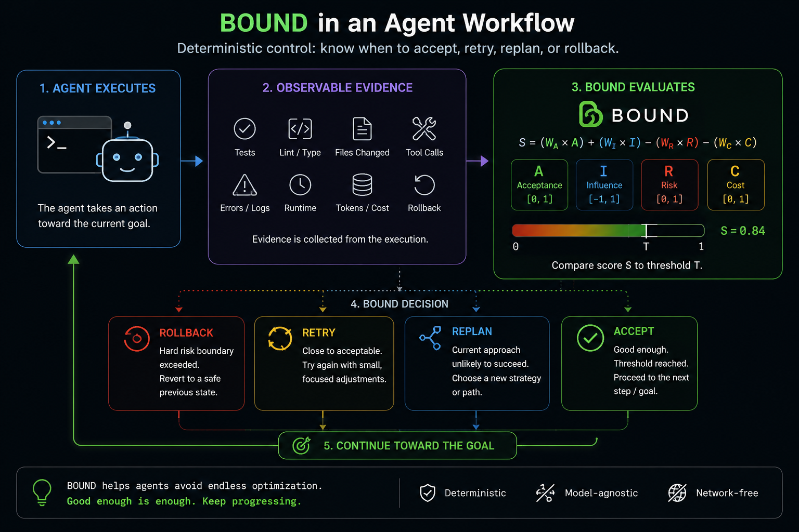

# BOUND v0.4 — Agent Integration & Dogfooding

## Objective

Make BOUND genuinely usable inside existing agent workflows.

v0.3 proved the deterministic evaluation pipeline:

Plan / StepContract
        ↓
Agent execution
        ↓
ExecutionEvidence
        ↓
ContractEvaluator
        ↓
BOUND policy
        ↓
ACCEPT / RETRY / REPLAN / ROLLBACK

v0.4 must prove that an actual agent can consume this control loop with minimal integration work.

The primary user experience should become:

    pip install bound-policy

then either:

    1. import BOUND directly into an agent loop

or:

    2. give an agent a BOUND integration prompt and let the agent wire
       BOUND into its own workflow.

No LLM-as-judge in v0.4.

No provider-specific LLM SDK dependency.

No network dependency in the BOUND evaluation path.

The central v0.4 question is:

> Can a real coding agent install BOUND, evaluate meaningful execution
> boundaries, and change its control flow based on deterministic evidence?

Work top to bottom. Do not proceed when tests from an earlier phase fail.

---

# Phase 0 — Verify and simplify the public v0.3 API

Before building integrations, inspect the actual current public API.

The goal is that a normal agent integration must not require knowledge of
internal implementation details.

Review specifically:

- BoundWorkflow
- BoundPolicy
- ContractEvaluator
- StaticEvaluator
- StaticContractGenerator
- StepContract
- ExecutionEvidence
- BoundCriteria

Remove any vestigial placeholder requirements from the contract evaluation path.

In particular, investigate whether this pattern is still required:

    BoundPolicy(StaticEvaluator(placeholder_scores))

If the evaluator is never used during contract-based evaluation, remove this
requirement cleanly rather than documenting the workaround.

Target API:

    workflow = BoundWorkflow()

or another similarly minimal construction.

Then:

    result = workflow.evaluate_step(
        contract=contract,
        evidence=evidence,
        criteria=criteria,
    )

Requirements:

- preserve backwards compatibility where reasonable
- do not duplicate policy logic
- keep the deterministic core unchanged
- add tests for the simplified public API

Definition of done:

    A complete contract evaluation can be expressed in approximately
    20–30 lines of normal user code without placeholder objects.

---

# Phase 1 — Framework-neutral agent control API

Add a thin integration layer for agent consumers.

Suggested module:

    src/bound/integration.py

Add:

    AgentControlResult

Suggested shape:

    class AgentControlResult(BaseModel):
        evaluation: EvaluationResult
        next_action: Literal[
            "continue",
            "retry",
            "replan",
            "rollback",
        ]
        feedback: str

Add a high-level helper:

    evaluate_agent_step(
        contract,
        evidence,
        criteria,
        ...
    ) -> AgentControlResult

The mapping must be exact and deterministic:

    ACCEPT   -> continue
    RETRY    -> retry
    REPLAN   -> replan
    ROLLBACK -> rollback

This layer must not:

- invent scores
- modify a BOUND decision
- call an LLM
- know anything about Cline, Claude Code, or another framework
- execute rollback itself
- execute retries itself

It translates BOUND's decision into an agent-control instruction.

Add unit tests for all four mappings.

---

# Phase 2 — Deterministic agent feedback

Make BOUND results directly reusable inside an agent context.

For example:

    Decision: RETRY

    The current step is close to acceptable.

    2 of 3 required checks passed.
    The remaining failing check is `tests-pass`.

    Keep the current approach and make one focused correction.

Feedback must be derived exclusively from:

- EvaluationResult
- contract
- evidence
- provenance

Do not ask an LLM to generate feedback.

Required behavior:

ACCEPT:

    Explain that the step is sufficiently complete.
    Tell the agent to continue to the next objective.
    Explicitly discourage unnecessary further optimization.

RETRY:

    Identify remaining failed or missing evidence where possible.
    Tell the agent to stay within the current strategy.

REPLAN:

    Explain that the current result is too far from the threshold.
    Tell the agent to choose a materially different approach.

ROLLBACK:

    Identify the hard risk boundary where possible.
    Tell the agent to return to a safe state before continuing.

Keep feedback concise enough to re-inject into an agent context.

Target:

    < 150 words

Add deterministic snapshot/golden tests.

---

# Phase 3 — Integration specification

Add a framework-neutral machine-readable integration specification.

CLI:

    bound integration-spec

The specification must define:

WHEN TO CALL BOUND:

- after a meaningful plan step
- after implementation plus verification
- after a retry
- before deciding to continue refining the same objective

WHEN NOT TO CALL BOUND:

- after every token
- after every file read
- after every shell command
- after every low-level tool call

THE REQUIRED FLOW:

    StepContract
        ↓
    agent executes
        ↓
    collect observable evidence
        ↓
    evaluate with BOUND
        ↓
    apply control decision

EVIDENCE RULE:

    Never fabricate unavailable evidence.

If evidence is unavailable:

- represent it as unavailable
- allow the configured deterministic policy to handle it
- never convert assumptions into successful checks

Expose the integration spec as structured JSON where practical.

Add CLI tests.

---

# Phase 4 — Generic self-integration prompt

Add:

    integrations/generic/INSTALL_BOUND.md

This is not documentation for a human.

It is a prompt designed to be pasted directly into a coding agent.

The prompt must instruct the agent to:

1. Install the latest stable `bound-policy`.
2. Inspect the installed public API instead of assuming it.
3. Inspect the current project and execution workflow.
4. Identify meaningful plan-step boundaries.
5. Identify observable evidence already available.
6. Report the proposed integration before modifying anything.
7. Create or map meaningful steps to StepContract.
8. Collect ExecutionEvidence after execution.
9. Evaluate the step using BOUND.
10. Apply the returned control action.
11. Never fabricate evidence.
12. Never duplicate BOUND's policy logic.
13. Never add an LLM evaluator.
14. Keep the integration thin and removable.
15. Add an end-to-end test.

Before implementation the agent must output:

    Integration point:
    Step boundary:
    Available evidence:
    Missing evidence:
    Control-flow mapping:
    Files to modify:

The prompt must explicitly state:

    BOUND decides whether to continue, retry, replan, or rollback.
    BOUND does not decide what code to write.

---

# Phase 5 — Cline integration

Cline is the first priority real-world integration.

Add:

    integrations/cline/INSTALL_BOUND.md

Do not assume undocumented Cline hooks.

The installation prompt must first instruct Cline to inspect the mechanisms
actually available in the current environment.

Preferred conceptual integration boundary:

    Cline executes meaningful task/subtask
            ↓
    verification runs
            ↓
    evidence collected
            ↓
    BOUND evaluates
            ↓
    Cline reacts to decision

Potential evidence:

- tests
- lint
- type checks
- expected files
- unexpected files
- failed commands
- retries
- tool calls where observable
- tokens where observable
- runtime where observable
- rollback availability

Decision behavior:

    ACCEPT
    -> stop refining the current step
    -> continue to the next plan objective

    RETRY
    -> preserve the current strategy
    -> perform one focused correction

    REPLAN
    -> stop iterating on the current strategy
    -> choose a materially different approach

    ROLLBACK
    -> restore a safe state where possible
    -> then replan

Do not hardcode Cline-specific behavior into `src/bound/`.

---

# Phase 6 — Additional agent integration prompts

Add lightweight prompts for:

    integrations/claude-code/INSTALL_BOUND.md
    integrations/kilo-code/INSTALL_BOUND.md
    integrations/hermes-agent/INSTALL_BOUND.md

These may share the generic integration contract.

Do not pretend native integrations exist if they do not.

Each prompt must instruct the agent to inspect its real available hooks,
commands, instructions, or workflow mechanisms before integrating.

The core package must remain framework-neutral.

---

# Phase 7 — Runnable real agent-loop example

Add:

    examples/agent_control_loop.py

The example must demonstrate a multi-step trajectory using the real public API.

Required trajectory:

    Attempt 1
        ↓
    insufficient evidence/result
        ↓
    REPLAN

    Attempt 2
        ↓
    close to threshold
        ↓
    RETRY

    Attempt 3
        ↓
    required checks satisfied
        ↓
    ACCEPT

Do not manually hardcode decisions.

The decisions must result from:

    StepContract
    +
    ExecutionEvidence
    +
    ContractEvaluator
    +
    BoundPolicy

At the end print:

    attempts
    decisions
    final score
    threshold
    avoided hypothetical extra steps

Clearly label avoided steps as simulated unless measured from a real run.

---

# Phase 8 — Cline dogfooding experiment

Add:

    experiments/cline/

Include:

    README.md
    task.md
    expected_contract.json
    results/

Use a small but non-trivial coding task.

Recommended task:

    Add robust input validation to a small API endpoint,
    including tests for valid, invalid, and edge-case input.

Run two comparable trajectories where practical:

    baseline
    BOUND-controlled

Capture:

- task success
- tests
- number of agent steps
- retries
- replans
- tool calls if observable
- token usage if observable
- runtime if observable
- point where BOUND returned ACCEPT
- work performed after the task was already satisfactory

Do not claim improvement from one experiment.

The purpose is to establish the first reproducible real-agent trace.

---

# Phase 9 — README rewrite: integration first

Rewrite README.md around the actual product experience.

The README must answer these questions in order:

1. What is BOUND?
2. Why would I put it in an agent?
3. How do I install it?
4. How does an agent use it?
5. What does a real evaluation look like?
6. How do I integrate it into my agent?
7. What are the limitations?

Target:

    approximately 150–250 lines maximum

Do not turn README back into the complete technical specification.

Move detailed material into `docs/`.

Required README structure:

    Hero
    ↓
    Agent workflow image
    ↓
    Install
    ↓
    Put BOUND in your agent
    ↓
    End-to-end example
    ↓
    How the four decisions work
    ↓
    How evidence becomes a score
    ↓
    Integration links
    ↓
    Current status
    ↓
    Documentation

---

# Phase 10 — Add the agent workflow image

Add the generated workflow image to:

    assets/bound-agent-workflow.png

Display it prominently near the top of README.md.

Suggested placement:

    tagline
        ↓
    2–3 sentence pitch
        ↓
    image
        ↓
    install

Use:

    

      
    

Verify:

- renders on GitHub
- renders on PyPI
- image is included in the source distribution if required
- README does not rely on the image to explain essential behavior

IMPORTANT:

PyPI may not reliably render repository-relative image paths from package
metadata.

Before release, verify the rendered PyPI project page.

If necessary, use the absolute raw GitHub image URL in README instead.

---

# Phase 11 — Concrete end-to-end README example

The README must contain one complete, runnable example.

No disconnected snippets.

It should show:

    contract
        ↓
    evidence
        ↓
    evaluate
        ↓
    result
        ↓
    control action

Example output:

    Acceptance: 0.67
    Risk: 0.00
    Cost: 0.25
    Score: 0.72
    Threshold: 0.75
    Decision: RETRY
    Next action: retry

Then show a second evaluation briefly:

    Acceptance: 1.00
    Score: 0.84
    Threshold: 0.75
    Decision: ACCEPT
    Next action: continue

This must use the exact real API and must be executed before copying its
output into README.

Do not invent output.

---

# Phase 12 — Explain evidence → scores without bloating README

Add a compact section.

Example:

    2 / 3 required checks passed
            ↓
    Acceptance = 0.67

    5 / 20 tool-call budget used
            ↓
    Cost contribution = 0.25

    no violated risk checks
            ↓
    Risk = 0.00

Then:

    BOUND applies the configured weights and threshold.

Explicitly state:

- default weights
- where weights are configured
- that defaults are reference defaults
- thresholds require workload-specific calibration

Link to detailed scoring documentation.

---

# Phase 13 — Clarify objective vs subjective evidence

README must explicitly distinguish:

OBJECTIVE / OBSERVABLE:

- tests
- lint
- type checks
- artifacts
- budgets
- retries
- runtime
- rollback state

SUBJECTIVE / SEMANTIC:

- code quality
- architectural elegance
- UX quality
- whether prose is "good"

State clearly:

    BOUND does not magically convert subjective goals into objective evidence.

Subjective criteria require an external evidence source, such as:

- human review
- deterministic rubric where possible
- static analysis
- reward model
- optional future semantic evaluator

The final BOUND policy can still remain deterministic after that evidence is supplied.

Do not add LLM-as-judge in v0.4.

---

# Phase 14 — README integration links

Once the files actually exist, add:

    Add BOUND to your agent:

    Generic agent
    Cline
    Claude Code
    Kilo Code
    Hermes Agent

Do not use language such as:

    "native Cline integration"

unless a native integration actually exists.

Prefer:

    "Integration prompt for Cline"

or:

    "Use BOUND with Cline"

---

# Phase 15 — Packaging verification

Verify the published package contains everything required by the integration experience.

Check:

    wheel
    source distribution

Ensure required package files are present.

Repository-only integration prompts do not necessarily need to ship inside the wheel,
but this must be an explicit decision.

Verify from a completely clean environment:

    pip install bound-policy

Then:

    python -c "import bound; print(bound.__version__)"
    bound --help
    bound integration-spec

Run the public README example against the installed PyPI-style package,
not against `src/` through pytest configuration.

---

# Phase 16 — Tests

Add or update tests for:

- simplified public workflow API
- AgentControlResult
- all four decision mappings
- deterministic feedback
- integration-spec CLI
- no LLM/network dependency
- no framework dependency in core
- end-to-end agent-loop example
- README example or equivalent executable example
- backwards compatibility where retained

Required:

    uv run ruff check .
    uv run pytest -q
    uv build

All must pass.

---

# Phase 17 — Documentation cleanup

Move detailed README material into:

    docs/concepts.md
    docs/contracts.md
    docs/architecture.md
    docs/scoring.md
    docs/integrations.md
    docs/status-and-roadmap.md

README should link to these instead of duplicating them.

Remove stale statements such as:

    "agent integrations are being added"

once the integration prompts actually exist.

Update CHANGELOG.md.

Version:

    0.4.0

---

# Definition of Done

BOUND v0.4 is complete when:

- [ ] `pip install bound-policy` installs the package cleanly
- [ ] the public contract API is simple enough for a short end-to-end example
- [ ] no placeholder evaluator is required for contract evaluation
- [ ] an agent-control result maps all four BOUND decisions deterministically
- [ ] deterministic feedback can be re-injected into an agent
- [ ] `bound integration-spec` works
- [ ] a generic self-integration prompt exists
- [ ] a Cline integration prompt exists
- [ ] at least two additional agent integration prompts exist
- [ ] no integration claims undocumented framework hooks
- [ ] a real multi-step agent-loop example runs
- [ ] the Cline dogfooding experiment is documented
- [ ] the README is integration-first and concise
- [ ] the README contains one tested end-to-end example
- [ ] the generated agent workflow image is prominently included
- [ ] objective vs subjective evidence is explained honestly
- [ ] default weights and configuration are visible
- [ ] no LLM judge is required or introduced
- [ ] the deterministic core remains network-free
- [ ] Ruff passes
- [ ] all tests pass
- [ ] package builds successfully

## Final v0.4 demo

The release should be demonstrable as:

    pip install bound-policy
            ↓
    give Cline the BOUND integration prompt
            ↓
    Cline inspects the project and proposes an integration
            ↓
    agent executes a meaningful coding step
            ↓
    tests / checks / execution evidence are collected
            ↓
    BOUND evaluates
            ↓
    RETRY / REPLAN / ROLLBACK / ACCEPT
            ↓
    agent changes its behavior
            ↓
    ACCEPT stops unnecessary optimization
            ↓
    agent continues toward the larger goal

The release is not complete merely because the integration prompt exists.

At least one real Cline run must be performed and documented.